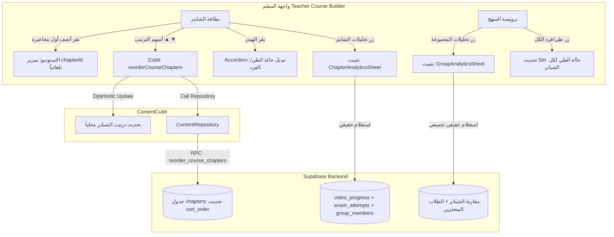

# 📐 الخطة الهندسية الشاملة: تطوير نظام الشباتر والتحليلات الأكاديمية (V1)
> **EduSaaS Academic Course Builder: Chapter Reordering, Accordion UX, and Dual-Tier Analytics**  
> **تاريخ التوثيق:** 2026-10-09  
> **الإصدار:** 1.0 (معتمد للتنفيذ بعد المراجعة)  
> **البيئة المستهدفة:** Flutter Web & Mobile + Supabase Multi-Tenancy  
> **المسار في المشروع:** `docs/CHAPTER_MANAGEMENT_AND_ANALYTICS_PLAN.md`

---

## 📑 جدول المحتويات
1. [الملخص التنفيذي والأهداف](#1-الملخص-التنفيذي-والأهداف)
2. [المعمارية التقنية للمحاور الخمسة](#2-المعمارية-التقنية-للمحاور-الخمسة)
   - [المحور 1: الربط التلقائي للشابتر في الاستوديو](#المحور-1-الربط-التلقائي-للشابتر-في-الاستوديو)
   - [المحور 2: حرية الترتيب اليدوي للشباتر](#المحور-2-حرية-الترتيب-اليدوي-للشباتر)
   - [المحور 3: نظام طي وفرد الشباتر (Collapsible Accordion)](#المحور-3-نظام-طي-وفرد-الشباتر)
   - [المحور 4: تحليلات الشابتر الأكاديمية (Chapter Analytics)](#المحور-4-تحليلات-الشابتر-الأكاديمية)
   - [المحور 5: لوحة تحليلات المجموعة البانورامية (Group Master Analytics)](#المحور-5-لوحة-تحليلات-المجموعة-البانورامية)
3. [مخطط تدفق البيانات (Architecture & Data Flow)](#3-مخطط-تدفق-البيانات)
4. [مصفوفة الملفات المتأثرة والتغييرات المطلوبة](#4-مصفوفة-الملفات-المتأثرة)
5. [عقود استعلامات Supabase (100% Real Data)](#5-عقود-استعلامات-supabase)
6. [قاموس التعريب الفوري (Zero Localization Debt)](#6-قاموس-التعريب-الفوري)
7. [قائمة المهام والتشيك ليست التفصيلية (Master Checklist)](#7-قائمة-المهام-والتشيك-ليست-التفصيلية)
8. [شروط القبول والاختبار (Definition of Done)](#8-شروط-القبول-والاختبار)

---

## 1. الملخص التنفيذي والأهداف

يهدف هذا المشروع إلى سد الفجوات العملية في تجربة منشئ المحتوى الأكاديمي للمعلم (Teacher Course Builder)، ومنح المعلم أدوات تحكم كاملة وسلسة في تنظيم المنهج، بالإضافة إلى تزويده بتحليلات أكاديمية تفصيلية حية ومباشرة من قاعدة البيانات (Supabase) على مستويين:
1. **مستوى الشابتر المنفرد (Micro Analytics):** كشف نقاط القوة والضعف ومعدلات الإكمال وكويزات كل شابتر.
2. **مستوى المجموعة الأكاديمية ككل (Macro Analytics):** نظرة شمولية على الدفعة بالكامل، ومقارنة نسب إنجاز الشباتر، ورصد فوري للطلاب المتعثرين الذين يحتاجون متابعة شخصية.

---

## 2. المعمارية التقنية للمحاور الخمسة

### المحور 1: الربط التلقائي للشابتر في الاستوديو
* **المشكلة الحالية:**  
  عند النقر على زر *"أضف أول محاضرة لهذا الشابتر"* في بطاقة الشابتر الفارغ داخل `teacher_content_library_page.dart` (السطر 1651)، يُستدعى التابع `_handleAddLesson` دون تمرير المعامل `chapterId`. نتيجة لذلك، يستقبل `LessonStudioWorkspace` القيمة `initialChapterId: null`، فيُحدد تلقائياً خيار *"بدون شبتر (محاضرة عامة)"*.
* **الحل الهندسي:**  
  1. تمرير `chapterId: chapter.id` مباشرة عند الضغط على الزر في بطاقة الشابتر الفارغ:  
     `onPressed: () => _handleAddLesson(chapterId: chapter.id)`.
  2. في شاشة `LessonStudioWorkspace`: ربط `_batchGlobalChapterId` و `_selectedChapterId` بـ `widget.initialChapterId` لضمان أن كل فيديو جديد يُضاف فردياً أو كدفعة (Batch) يُسند تلقائياً إلى هذا الشابتر.

---

### المحور 2: حرية الترتيب اليدوي للشباتر
* **الهدف:**  
  تمكين المعلم من إعادة ترتيب الشباتر (تحريك لأعلى ▲ ولأسفل ▼) وحفظ الترتيب لحظياً في قاعدة البيانات وانعكاسه الفوري على تطبيق الطالب.
* **الحل الهندسي:**  
  1. استدعاء الدالة البرمجية `reorderCourseChapters` الموجودة مسبقاً في `ContentRepository` ومهاجرة Supabase (`0050_chapter_management_helpers.sql` عبر الـ RPC: `reorder_course_chapters`).
  2. إضافة التابع `reorderCourseChapters` داخل `ContentCubit` مع التحديث المتفائل للحالة المحلية (Optimistic UI Update) لسرعة الاستجابة.
  3. إضافة أسهم الترتيب في هيدر بطاقة كل شابتر في `teacher_content_library_page.dart`:
     - سهم لأعلى `Icons.keyboard_arrow_up_rounded`: يُعطل إذا كان الشابتر الأول.
     - سهم لأسفل `Icons.keyboard_arrow_down_rounded`: يُعطل إذا كان الشابتر الأخير.
  4. التحقق من مطابقة استعلام الطالب في `StudentContentFeedPage` لفرز الشباتر حسب `sort_order ASC`.

---

### المحور 3: نظام طي وفرد الشباتر (Collapsible Accordion)
* **الهدف:**  
  توفير المساحة العمودية للمعلم عندما يكون المنهج كبيراً ويحتوي على عشرات المحاضرات، بحيث يستطيع طي الشباتر التي لا يعمل عليها حالياً.
* **الحل الهندسي:**  
  1. إضافة حالة محلية: `Set<String> _collapsedChapterIds = {};`.
  2. النقر على هيدر الشابتر أو سهم التوسيع/الطي يبدل حالته باستخدام انتقال انسيابي ناعم (`AnimatedCrossFade`).
  3. في حالة الطي، تظهر بطاقة الشابتر كشريط أفقي مدمج ومريح يعرض:
     - رقم الشابتر وعنوانه الأكاديمي.
     - شارة عدد المحاضرات (مثال: `4 محاضرات`).
     - شارة حالة النشر (أخضر للمنشور / كهرماني للمسودة).
     - أدوات الإجراءات السريعة (تحليلات الشابتر، أسهم الترتيب، زر التعديل، زر الحذف).
  4. إضافة زر في شريط أدوات المنهج العلوي: `[ طي الكل / فرد الكل ]` (`_toggleCollapseAllChapters()`).

---

### المحور 4: تحليلات الشابتر الأكاديمية (Chapter Analytics)
* **الهدف:**  
  تزويد المعلم برؤية دقيقة لمستوى تفاعل الطلاب داخل شابتر معين لمعرفة هل الشابتر مفهوم أم يحتاج إعادة شرح.
* **المؤشرات الحسابية (Metrics Contract - 100% Real Supabase Data):**
  1. **إجمالي المشاهدات (Total Views):** مجموع سجلات المشاهدة الفعلية لكل فيديوهات هذا الشابتر من جدول `video_progress` (حيث `progress_seconds > 0`).
  2. **نسبة إكمال الشابتر (Chapter Completion Rate):** النسبة المئوية للطلاب النشطين في المجموعة الذين أكملوا مشاهدة جميع محاضرات الشابتر (`completed == true`).
  3. **متوسط كويزات الشابتر (Chapter Quizzes Average):** متوسط درجات الطلاب في كافة كويزات محاضرات الشابتر من جدول `exam_attempts` (`percentage`).
  4. **شريط توزيع الإنجاز (Student Progress Distribution):**
     - طلاب أتموا الشابتر بالكامل (100%).
     - طلاب قيد الدراسة (1% - 99%).
     - طلاب لم يبدأوا بعد (0%).
* **موقع العرض:**  
  زر مخصص في هيدر الشابتر: `[ 📊 تحليلات الشبتر ]` يفتح نافذة منبثقة أنيقة (`ChapterAnalyticsSheet`) متوافقة تماماً مع نظام التصميم الأكاديمي.

---

### المحور 5: لوحة تحليلات المجموعة البانورامية (Group Master Analytics)
* **الهدف:**  
  إعطاء المعلم لوحة قيادة مركزية لمتابعة الدفعة بالكامل دون الحاجة للدخول لكل محاضرة على حدة.
* **المؤشرات الحسابية (Metrics Contract):**
  1. **نسبة إنجاز المنهج الكلي (Overall Course Progress):** متوسط نسب إنجاز كافة طلاب المجموعة النشطين عبر جميع محاضرات المنهج.
  2. **إجمالي ساعات/مرات المشاهدة (Total Watch Engagement):** إجمالي عدد المشاهدات المسجلة لكافة دروس المنهج.
  3. **المتوسط العام لاختبارات المجموعة (Overall Quizzes Average):** متوسط درجات الدفعة في كافة الاختبارات المرتبطة بدروس المنهج.
  4. **مقارنة الشباتر (Chapter Breakdown Comparison):** شريط بياني مقارن يوضح نسبة إنجاز كل شابتر على حدة، مما يُمكّن المعلم فوراً من تمييز الشابتر الذي يعاني فيه الطلاب من تأخر.
  5. **قائمة الطلاب بحاجة لمتابعة (Students Needing Attention):** حصر فوري بالاسم والصورة لكل طالب تقل نسبة إنجازه الكلية عن 50% مع زر مباشر للتواصل أو عرض ملفه.
* **موقع العرض:**  
  زر بارز في ترويسة المنهج الرئيسية بجانب زر إضافة المحاضرة: `[ 📊 تحليلات المجموعة ]` يفتح شيت متكامل (`GroupAnalyticsSheet`).

---

## 3. مخطط تدفق البيانات



---

## 4. مصفوفة الملفات المتأثرة

| المسار | نوع التعديل | الدور الوظيفي |
|---|:---:|---|
| `lib/features/content/presentation/pages/teacher_content_library_page.dart` | تعديل | تصحيح تمرير `chapterId`، إضافة أسهم الترتيب، إدارة حالة الأكورديون، وأزرار التحليلات |
| `lib/features/content/presentation/widgets/lesson_studio_workspace.dart` | تعديل | ضمان اعتماد `initialChapterId` لكافة الفيديوهات والمجلدات المحددة بالدفعة |
| `lib/features/content/presentation/cubit/content_cubit.dart` | تعديل | إضافة دالة `reorderCourseChapters` مع Optimistic UI وإبطال الكاش |
| `lib/features/content/presentation/widgets/chapter_analytics_sheet.dart` | **إنشاء جديد** | واجهة عرض تحليلات الشابتر المنفرد (100% Real Supabase Data) |
| `lib/features/content/presentation/widgets/group_analytics_sheet.dart` | **إنشاء جديد** | واجهة لوحة تحليلات المجموعة الشاملة والطلاب المتعثرين |
| `lib/core/localization/arb/app_en.arb` | تعديل | إضافة كافة النصوص بالإنجليزية فورياً |
| `lib/core/localization/arb/app_ar.arb` | تعديل | إضافة كافة النصوص بالعربية المطابقة 100% |

---

## 5. عقود استعلامات Supabase

### 1. استعلام تحليلات الشابتر (`ChapterAnalyticsSheet`):
```sql
-- 1. الطلاب النشطين في المجموعة
SELECT id FROM public.group_members 
WHERE group_id = :groupId AND status = 'active';

-- 2. فيديوهات محاضرات هذا الشابتر
SELECT v.id FROM public.videos v
JOIN public.content_groups cg ON cg.content_id = v.content_id
WHERE cg.group_id = :groupId AND cg.chapter_id = :chapterId;

-- 3. سجلات التقدم الفعلية
SELECT student_id, completed, progress_seconds FROM public.video_progress
WHERE video_id IN (:videoIds);

-- 4. كويزات الشابتر ومتوسط الدرجات
SELECT ea.percentage FROM public.exam_attempts ea
JOIN public.content_groups cg ON cg.associated_exam_id = ea.exam_id
WHERE cg.group_id = :groupId AND cg.chapter_id = :chapterId
  AND ea.status IN ('submitted', 'completed');
```

### 2. استعلام تحليلات المجموعة (`GroupAnalyticsSheet`):
```sql
-- استخدام الدالة القائمة get_group_course_progress أو الاستعلام المباشر المجمع:
-- حساب متوسط الإنجاز الكلي للدفعة + حصر الطلاب الذين إنجازهم أقل من 50%
```

---

## 6. قاموس التعريب الفوري (Zero Localization Debt)

| المفتاح (Localization Key) | الترجمة العربية (`app_ar.arb`) | الترجمة الإنجليزية (`app_en.arb`) |
|---|---|---|
| `collapseAllChapters` | طي كافة الشباتر | Collapse All Chapters |
| `expandAllChapters` | فرد كافة الشباتر | Expand All Chapters |
| `moveChapterUp` | نقل الشبتر لأعلى | Move Chapter Up |
| `moveChapterDown` | نقل الشبتر لأسفل | Move Chapter Down |
| `chapterAnalytics` | تحليلات الشبتر | Chapter Analytics |
| `groupAnalytics` | تحليلات المجموعة | Group Analytics |
| `chapterCompletionRate` | نسبة إكمال الشبتر | Chapter Completion Rate |
| `overallCourseProgress` | نسبة إنجاز المنهج الكلي | Overall Course Progress |
| `chapterBreakdown` | أداء الطلاب حسب الشباتر | Chapter Progress Breakdown |
| `studentsNeedingAttention` | طلاب بحاجة لمتابعة | Students Needing Attention |
| `totalChapterViews` | إجمالي مشاهدات الشبتر | Total Chapter Views |
| `averageChapterQuizScore` | متوسط كويزات الشبتر | Chapter Quizzes Average |
| `noStudentsNeedingAttention` | جميع الطلاب يحققون تقدماً ممتازاً | All students are making great progress |
| `activeStudentsCount` | عدد الطلاب النشطين | Active Students Count |

---

## 7. قائمة المهام والتشيك ليست التفصيلية (Master Checklist)

### 🔹 المرحلة 1: الربط التلقائي للشابتر في الاستوديو
- [x] تصحيح زر `emptyChapterTeacherAction` في السطر 1651 من `teacher_content_library_page.dart` لتمرير `chapterId: chapter.id`.
- [x] التحقق من جميع أزرار "إضافة محاضرة" داخل بطاقات الشباتر أنها تمرر `chapterId`.
- [x] التأكد في `lesson_studio_workspace.dart` من ضبط `_batchGlobalChapterId` و `_selectedChapterId` على `widget.initialChapterId`.
- [x] التأكد عند اختيار فولدر كامل أو فيديوهات متعددة أنها تأخذ تلقائياً الشابتر الممرر كافتراضي.

### 🔹 المرحلة 2: حرية الترتيب اليدوي للشباتر (Chapter Reordering)
- [x] كتابة دالة `reorderCourseChapters` في `ContentCubit` مع Optimistic UI واستدعاء `contentRepository.reorderCourseChapters`.
- [x] إضافة أزرار الأسهم (`Icons.keyboard_arrow_up_rounded` و `Icons.keyboard_arrow_down_rounded`) في هيدر الشابتر بـ `teacher_content_library_page.dart`.
- [x] تفعيل/تعطيل الأسهم تلقائياً بناءً على موقع الشابتر (الزر العلوي معطل للشابتر الأول، والسفلي معطل للأخير).
- [x] التحقق من حفظ الترتيب في جدول `chapters` بقاعدة بيانات Supabase.
- [x] التحقق من أن ترتيب الشباتر لدى الطالب في `StudentContentFeedPage` يطابق تماماً ترتيب المعلم بناءً على `sort_order ASC`.

### 🔹 المرحلة 3: نظام طي وفرد الشباتر (Collapsible Accordion)
- [x] تعريف متغير الحالة `Set<String> _collapsedChapterIds` في صفحة إدارة المنهج.
- [x] ربط النقر على هيدر الشابتر أو أيقونة السهم لتبديل حالة الطي والفرد.
- [x] تصميم المظهر المدمج الأنيق للشابتر عند الطي (العنوان، عدد المحاضرات، الحالة، أزرار الإجراءات السريعة).
- [x] إضافة زر `[ طي الكل / فرد الكل ]` في شريط أدوات ترويسة المنهج.
- [x] إضافة تأثير حركي ناعم أثناء الفرد والطي باستخدام `AnimatedCrossFade`.

### 🔹 المرحلة 4: تحليلات الشابتر الأكاديمية (Chapter Analytics)
- [x] إنشاء ويدجت `ChapterAnalyticsSheet` داخل `lib/features/content/presentation/widgets/`.
- [x] برمجة دوال جلب البيانات الحقيقية من Supabase (المشاهدات، نسبة الإكمال، متوسط الكويزات، توزيع الطلاب).
- [x] إضافة زر `[ 📊 تحليلات الشبتر ]` في هيدر الشابتر للمعلم.
- [x] بناء الحالات الأربع الإلزامية في الشيت: التحميل (Skeleton)، البيانات الفارغة (Empty)، الخطأ (Error)، والنجاح.
- [x] التأكد من الاعتماد 100% على بيانات حقيقية دون أي أرقام وهمية أو افتراضية.

### 🔹 المرحلة 5: لوحة تحليلات المجموعة البانورامية (Group Master Analytics)
- [x] إنشاء ويدجت `GroupAnalyticsSheet` داخل `lib/features/content/presentation/widgets/`.
- [x] برمجة جلب مؤشرات المجموعة: نسبة إنجاز المنهج العام، إجمالي المشاهدات، المقارنة البيانية للشباتر، وقائمة الطلاب المتعثرين (< 50%).
- [x] إضافة زر رئيسي في شريط الأدوات العلوي للمنهج: `[ 📊 تحليلات المجموعة ]`.
- [x] عرض بطاقات الطلاب المتعثرين مع نسب إنجازهم الفعلية لتمكين المعلم من التدخل السريع.
- [x] فحص التجاوب البصري الكامل للشيت على الهواتف والأجهزة اللوحية وشاشات الويب.

### 🔹 المرحلة 6: التعريب وجودة الكود والتحقق النهائي
- [x] إضافة كافة المفاتيح الجديدة في ملف `lib/core/localization/arb/app_en.arb`.
- [x] إضافة الترجمات العربية المطابقة بنسبة 100% في ملف `lib/core/localization/arb/app_ar.arb`.
- [x] تشغيل الأمر `flutter gen-l10n` والتأكد من توليد ملفات الترجمة دون أخطاء.
- [x] تشغيل `flutter analyze` والتأكد من الحصول على `No issues found!`.
- [x] تشغيل `flutter test` والتأكد من اجتياز كافة الاختبارات بنسبة 100%.
- [x] التأكد من عدم المساس بأي بيئة إنتاجية أو رفع (No Deployment).

---

## 8. شروط القبول والاختبار (Definition of Done)

1. ✅ عند الضغط على "أضف أول محاضرة لهذا الشابتر"، يفتح الاستوديو فوراً والشابتر محدد مسبقاً وتلقائياً ولا يظهر "بدون شبتر".
2. ✅ يستطيع المعلم تقديم أي شابتر أو تأخيره بنقرة واحدة، وينعكس الترتيب في الحال لدى الطالب.
3. ✅ طي الشباتر يعمل بسلاسة ويوفر مساحة الشاشة مع فاعلية زر "طي الكل / فرد الكل".
4. ✅ تحليلات الشابتر تعرض نسب حقيقية ومفيدة مستخرجة من قاعدة البيانات مباشرة.
5. ✅ تحليلات المجموعة تعرض شريط مقارنة واضح بين الشباتر وتُظهر المتعثرين بدقة.
6. ✅ التزام كامل بنظام الألوان والهوية الرياضية الأكاديمية (Deep Indigo `0xFF5B4FE0` و `AppCard`).
7. ✅ صفر ديون تعريب (100% ARB Matching) وصفر أخطاء في الـ Analyzer وجميع الاختبارات ناجحة.
